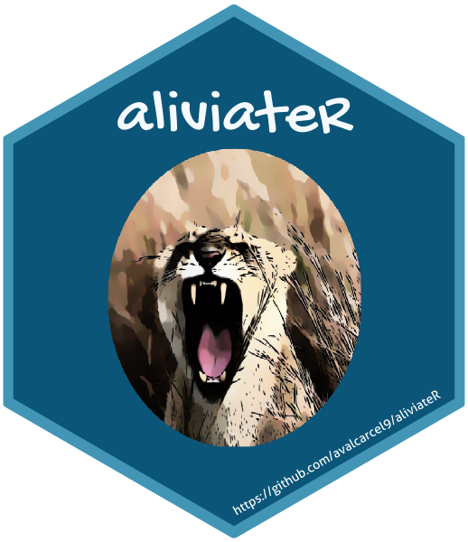

[](https://travis-ci.org/avalcarcel9/aliviateR)[](https://ci.appveyor.com/project/avalcarcel9/aliviater-6poks/branch/master)

<!-- README.md is generated from README.Rmd. Please edit that file -->

```{r setup, include = FALSE}
knitr::opts_chunk$set(
  collapse = TRUE,
  comment = "#>",
  fig.path = "man/figures/README-",
  out.width = "100%"
)
```
# aliviateR 

The goal of aliviateR is to help automate the process of building packages. It also contains functions that I constantly need for work. Maybe some of it is useful for you.

## Installation

`aliviateR` is currently only available as a development version from [GitHub](https://github.com/). You can download this version with:

``` r
# install.packages("devtools")
devtools::install_github("avalcarcel9/aliviateR")
```

For any issues, please feel free to email me or submit and issue.

## Functions

Currently, there are 6 functions available through `aliviateR`. Below I will define the functions.

The first function is very simple and just prints a generic roxygen header for a function and/or data.

```{r, eval = FALSE}
aliviateR::printroxygenheader(func = TRUE,
                              data = FALSE)
```

By default it returns only a function header but you can choose to return both or just a data header by changing the logicals.

The next function is `aliviateR::alval_flow()`. This function will create the project directory for a package similar to `File > New Project > R package `. In addition to creating the package directory filled in the proper package form, it allows you to edit the description with your personal information, add a vignette, add testing options, and adds the readme files.

```{r, eval = FALSE}
alval_flow(path = NULL, 
           pkg_name = NULL, 
           vignette_name = NULL,
           testing = TRUE, 
           data = TRUE
           title = "What the Package Does (One Line, Title Case)",
           description = "What the package does (one paragraph).",
           firstname = "Alessandra", 
           lastname = "Valcarcel",
           email = "alval@pennmedicine.com", 
           role = c("aut", "cre"))
```

Feel free to change the `firstname`, `lastname`, and `email` fields and use on your own. Type `?aliviateR::alval_flow` for documentation.

The next function `aliviateR::alval_git` initializes a GitHub repo for your package, adds, commits, and pushes the package contents to GitHub. __This requires that GitHub is properly configured on your machine and with RStudio.__ For more information on configuration see [RStudio Support](https://support.rstudio.com/hc/en-us/articles/200532077-Version-Control-with-Git-and-SVN), [R packages by Hadley Wickham](http://r-pkgs.had.co.nz/git.html), and [Blog](http://happygitwithr.com/rstudio-git-github.html).

At the minium you need your GitHub username and email set up as well as a token set up in your .Renviron. R also has to know where your ssh keys are. You can check if this is done already by running:

```{r, eval = FALSE}
usethis::use_git_config()
Sys.getenv("GITHUB_PAT")
git2r::cred_ssh_key()
```

If these are properly set up then `aliviateR::alval_git()` should run.

```{r, eval = FALSE}
alval_git(pkg_path = NULL, 
          credentials = NULL)
```

You'll need to specify the path to your package. By default the credentials are NULL. This arguement is passed to `devtools::usethis::use_git()` so check our their documentation for more info though `NULL` should still run. I set it to something special `credentials = alval` for a specialized path to my credentials. The other option is to input your own if `NULL` doesn't seem to work. After you run this, check that the package folder is set up as a repo on your GitHub.

The `aliviateR::alval_badges()` function adds continuous integration and coverage checks. Additionally, it returns the badges you can add to your readme.

```{r, eval = FALSE}
alval_badges(pkg_path = NULL, 
             gh_username = NULL, 
             interactive = TRUE,
             travis = TRUE,
             coverage = TRUE, 
             appveyor = TRUE,
             cran = TRUE)
```

You'll specify the path to your package and GitHub username. Running this will prompt many of the continous integration sites to open (if `interactive = TRUE`) and you can configure the setting options interactively. If you have already done this and just need the badges then set `interactive = FALSE`. You only need to to copy and paste the badges you specified into your readme. 

The `aliviateR::sort_filepaths()` function is a little different than the previous functions. It doesn't help with building packages but is useful in everday research. This function should be used when you would like to sort a data.frame or tibble of filepaths by an ID contained inside the filepath. The ID by default must larger than 3 numbers. If you want to provide a specific ID pattern use `id_pattern`. This is passed to `stringr::str_extract` so the pattern format should be accepted by that function. A tibble will be returned with an additional `id` column.


```{r, eval = FALSE}
sort_filepaths(filepaths, id_pattern = "[0-9][0-9][0-9]+")
```

The `aliviateR::multiple_filepaths()` function similarly does not help with building packages. This function wraps `list.files()` for a set of paths and patterns provided and creates a tibble of each of the files.

```{r, eval = FALSE}
multiple_filepaths(path, 
                   pattern = NULL, 
                   full.names = TRUE, 
                   sort = TRUE,
                   id_pattern = "[0-9][0-9][0-9]+")
```

As I work in imaging data, I've included some functions to help calculate Sørensen–Dice index or coefficient. This is $\dfrac{2 \times | X \cap Y| }{|X| + |Y|}$. `aliviateR::dsc()` will calculate the Sørensen–Dice index between two vectors or images. The input class must be the same so two vectors or two NIFTI objects. It doesn't really matter what vector or image is `gold_standard` or `comp_method` as you can see from the formula we can denote the objects as $X$ and $Y$ but in practice normally one image is a gold standard and the other is to compare.

```{r, eval = FALSE}
dsc(gold_standard, 
    comp_method)
```

The object returned is a single value representing Sørensen's–Dice index between the two objects.

I have also included a function, `aliviateR::dsc_mult_thresholds()`, that calculates Sørensen–Dice index or coefficient for a variety of thresholds input when provided a probability map. Again, `gold_standard` and `prob_map` can be vectors or NIFTI objects so long as they match. `thresholds` is a grid of thresholds you would like to threshold the probability map to obtain binary values. Notice, `mask = NULL` by default. A mask is required if you provide NIFTI objects but can remain NULL if the inputs are already vectorized.

```{r, eval = FALSE}
dsc_mult_thresholds(gold_standard, 
                    prob_map, 
                    thresholds, 
                    mask = NULL)
```

This function returns a `tibble` with a column of the `threshold` of the thresholds input and a column `dsc` of the Sørensen–Dice value for that threshold.

Often, I am importing many `.RData` or `.rda` objects that are saved in a single folder. This is especially useful for when the `.RData` file is the same and you planning to bind them.

```{r, eval = FALSE}
load_mrdata(path, 
            pattern,
            bind_rows = TRUE)
```

Simply provide the `path` to the folder that houses all of the saved objects and the `pattern` of the files you wish to import. If there is no pattern and you'd simply like to import everything set to `NULL`. The `bind_rows` option will bind the rows of objects supplied from path.

Whenever writing a paper or presenting my work I normally need to take screen shots of the nifti objects. Typically this is a single slice represented across a number of different images. For example, a single subjects axial slice from T1, T2, PD, and FLAIR images. Loading these into a viewer and individually saving or taking screen shots can be cumbersome. Instead, I wrote a function that will save slices of images specified by the user across a number of image inputs.

```{r, eval = FALSE}
save_slices(imgs,
            outfiles,
            format = c('png', 'pdf'),
            width = NULL,
            height = NULL,
            units = NULL,
            ...)
```

For a full example of my flow see the [vignette](https://github.com/avalcarcel9/aliviateR/blob/master/vignettes/vignette.Rmd) for an example.

