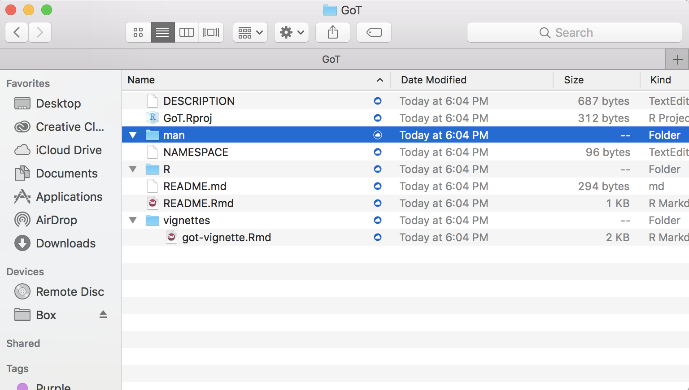
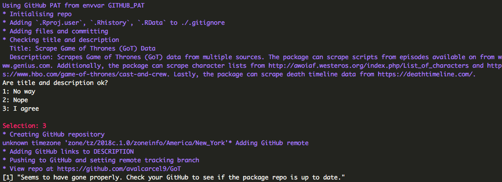
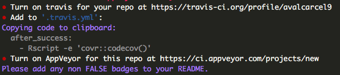

```{r setup, include = FALSE}
knitr::opts_chunk$set(
  collapse = TRUE,
  comment = "#>"
)
```

## Overview

In this vignette, we will walk through how to implement `aliviateR` functions to create a package. The package does not make creating a package fully automated and you will still need to tweak some of the package information before going live. We will go through how to use the `aliviateR` functions to help you create a package as well as what is leftover that you will need to change.

You will need GitHub installed and set up with R. Check out some more information in the readme or at these links:

[RStudio Support](https://support.rstudio.com/hc/en-us/articles/200532077-Version-Control-with-Git-and-SVN)

[R packages by Hadley Wickham](http://r-pkgs.had.co.nz/git.html)

[Blog](http://happygitwithr.com/rstudio-git-github.html)

## Installation

`aliviateR` is currently only available as a development version from [GitHub](https://github.com/). You can download this version with:

```{r, eval = FALSE}
# install.packages("devtools")
devtools::install_github("avalcarcel9/aliviateR")
```

```{r}
library(aliviateR)
```

For any issues, please feel free to email me or submit and issue.

## Tutorial Information

In this tutorial I am going to create an R package that scrapes Game of Thrones data from the internet. After this tutorial, I will actually host the package on my [GitHub](https://github.com/avalcarcel9). You can follow along whether you have functions or not but know that this will be generating folders on your machine.

## `roxygen2` Header

This function is very simple and just returns the roxygen header for either a function or data.

```{r}
aliviateR::printroxygenheader(func = TRUE,
                              data = FALSE)
```

You can change the logicals to obtain different headers. Each function in your package will need a header filled out to properly compile. This is just a generic header and you don't need all arguments.

## Create Package Structure

Before anything we will generate the package structure required to host a package using the function `aliviateR::alval_flow`. This function will:

1. Create a folder with the package name you specify in the path specified
2. Create a vignette `vignette_name` is not NULL
3. Create testing folder structure if `testing = TRUE`
4. Manipulate the DESCRIPTION file Title, Description, Maintainer, and Author@R fields based on the inputs.

By default these are set to my own personal preferences and information but you can easily change any for your own flow or package.

For this example, I am going to create an R package called "GoT". I changed the default `test = TRUE` to `testing = FALSE` as I don't want to set up testing for this package. I also specify a  `title` and `description` specific to this package. 

```{r, eval = FALSE}
alval_flow(path = '/Users/alval/Box/Research', 
           pkg_name = 'GoT', 
           vignette_name = 'GoT Vignette',
           testing = FALSE, 
           title = "Scrape Game of Thrones (GoT) Data",
           description = "Scrapes Game of Thrones (GoT) data from multiple sources. The package can scrape scripts from episodes available on from www.genius.com. Additionally, the package can scrape character lists from http://awoiaf.westeros.org/index.php/List_of_characters and https://www.hbo.com/game-of-thrones/cast-and-crew. Lastly, the package can scrape death timeline data from https://deathtimeline.com/.",
           firstname = "Alessandra", 
           lastname = "Valcarcel",
           email = "alval@pennmedicine.com", 
           role = c("aut", "cre"))
```

If you specified to allow for a vignette then the vignette will open in your R session. Unfortunately, I can't run this and show output without changing my local directories I'll show a screen shot of the output from successfully running this function.

<center><\center>

This functions wraps functions from `usethis`. Many will need user input to run so you will notice that you will need to respond with numbers to the prompts. For example, you can see I had to choose to modify the description and select "3: For sure". Be sure to read this carefully and answer with what you would like to do for your package.

If you go to the path you specified you will now see a folder with the package name you specified and some contents. Here is a screenshot of my folder.

<center><\center>

Notice that the man and R folders are empty. We will fill the R folder with content in a bit and will let `roxygen2` fill our man and namespace.

Before we move on though, you'll definitely need to go into the description and fix the Author@R field with your information returned from the function.

## Initalize with GitHub

I always want to host the package on GitHub for version control and to give users a development version with quick bug fixes. The `aliviateR::alval_git` function will initialize the package directory as GitHub repository, add the contents, commit the contents, and push. __This requires that GitHub is properly configured on your machine and with RStudio.__ For more information on configuration see the following see [RStudio Support](https://support.rstudio.com/hc/en-us/articles/200532077-Version-Control-with-Git-and-SVN), [R packages by Hadley Wickham](http://r-pkgs.had.co.nz/git.html), and [Blog](http://happygitwithr.com/rstudio-git-github.html).

At the minim you need your GitHub username and email set up as well as a token set up in your .Renviron. R also has to know where your ssh keys are. You can check if this is done already by running:

```{r, eval = FALSE}
usethis::use_git_config()
Sys.getenv("GITHUB_PAT")
git2r::cred_ssh_key()
```

If set up then `usethis::use_git_config()` shows your user name and email configured properly. Calling `Sys.getenv("GITHUB_PAT")` will return your token and `git2r::cred_ssh_key()` will return your private and public key locations.

If these are properly set up then `aliviateR::alval_git()` should run.

```{r}
alval_git(pkg_path = '/Users/alval/Box/Research/GoT', 
          credentials = 'alval')
```


I run this command with the specific `credentials = 'alval'` as I set up my own personal credentials. These credentials are passed to `devtools::usethis::use_git()`. The default for both functions is NULL or you can specify your own.

The output should look similar to the following screenshot.

<center></center>

You should check your own GitHub to see if the repo is up and the contents are there.

## Continuous Integration

The `aliviateR::alval_badges()` function adds continuous integration and coverage checks. Additionally, it returns the badges you can add to your readme to display the badges on GitHub.

```{r, eval = FALSE}
badges = alval_badges(pkg_path = '/Users/alval/Box/Research/GoT', 
                      gh_username = 'avalcarcel9', 
                      interactive = TRUE,
                      travis = TRUE,
                      coverage = TRUE, 
                      appveyor = TRUE)
badges$travis_badge
badges$coverage_badge
badges$appveyor_badge
```

You'll specify the path to your package and GitHub username. Running this will prompt many of the continuous integration sites to open (if `interactive = TRUE`) and you can configure the setting options interactively. If you have already done this and just need the badges then set `interactive = FALSE`. You only need to to copy and paste the badges you specified into your readme. 

In R you should see something similar to the screenshot provided below.



You'll specify the path to your package and GitHub username. Running this will prompt many of the continuous integration sites to open and you can configure the setting options interactively. Remember to copy and paste the badges into your readme.

## Check and Build

All that is left to do with your package is add your functions with roxygen headers, and then check and build with roxygen. I personally like to do this with the menu options in RStudio but you can do it through the command line or devtools.

```{r, eval = FALSE}
devtools::check(pkg = '/Users/alval/Box/Research/GoT)
```

Whenever you make changes to your package be sure you Clean and Rebuild.

## Other Functions

The `aliviateR::sort_filepaths()` function is a little different than the previous functions. It doesn't help with building packages but is useful in everyday research. This function should be used when you would like to sort a data.frame or tibble of file paths by an ID contained inside the file path. The ID must be larger than 3 numbers. A tibble will be returned with an additional `id` column.


```{r}
files = tibble::tibble(files1 = c('/Desktop/subject_111.csv', '/Desktop/subject_123.csv', '/Desktop/subject_902'),
                       files2 = c('/Documents/subject_111.csv', '/Documents/subject_902', '/Documents/subject_123.csv'))

sort_filepaths(filepaths = files)
```

Note that the 902 subject was out of order in the two columns in the original tibble but returned so that all columns match by ID after running the function. This function is especially useful when working with `list.files()` for multiple file paths.

The `aliviateR::multiple_filepaths()` function similarly does not help with building packages. This function wraps `list.files()` for a set of paths and patterns provided and creates a tibble of each of the files. To show an example, I downloaded the [The Longitudinal MS Lesion Segmentation Challenge](https://smart-stats-tools.org/lesion-challenge). I'll obtain the data and masks for one subject.

Here are the files in the directories:

```{r}
list.files('/Users/alval/Documents/ISBI_Challenge_2015/training/training01/preprocessed/')
list.files('/Users/alval/Documents/ISBI_Challenge_2015/training/training01/masks/')
```
For this example, I'll return the flair images from all time points from all time points and the masks labelled 'mask1'.

```{r}
paths = c('/Users/alval/Documents/ISBI_Challenge_2015/training/training01/preprocessed/', '/Users/alval/Documents/ISBI_Challenge_2015/training/training01/masks/')
patterns = c('flair_pp', 'mask1')
multiple_filepaths(path = paths, 
                   pattern = patterns, 
                   full.names = TRUE, 
                   sort = FALSE)
```


To calculate Sørensen's–Dice between two objects simply run `aliviateR::dsc()`. For this first example, let's create a simple vector to calculate.

```{r}
gold_standard = c(1,1,1,0,0,1,1,1)
comp_method = c(0,1,0,1,0,0,1,1)
dsc(gold_standard = gold_standard, comp_method = comp_method)
```

The object returned is a single value representing Sørensen's–Dice index between the two objects. In this simple case, I've provided a simple set of vectors as inputs. The function can be run with NIFTI objects as well. Simply read in the images and provide them as inputs. 

I have also included a function, `aliviateR::dsc_mult_thresholds()`, that calculates Sørensen–Dice index or coefficient for a variety of thresholds input when provided a probability map. Again, `gold_standard` and `prob_map` can be vectors or NIFTI objects so long as they match. `thresholds` is a grid of thresholds you would like to threshold the probability map to obtain binary values. Notice, `mask = NULL` by default. A mask is required if you provide NIFTI objects but can remain NULL if the inputs are already vectorized. In this example, I'll show it for vectors and therefore do not need a mask. If you provide NIFTI objects then you'll need to provide a mask of the area like a brain mask.

```{r}
prob_map =  runif(100, 0, 1)
gold_standard = ifelse(prob_map > 0.9, 1, 0)
thresholds = seq(from = 0, to = 1, by = 0.05)

dsc_mult_thresholds(gold_standard, 
                    prob_map, 
                    thresholds, 
                    mask = NULL)
```

This function returns a `tibble` with a column of the `threshold` of the thresholds input and a column `dsc` of the Sørensen–Dice value for that threshold. This function helps us assess what threshold on a probability map produces labels that perform well using Sørensen–Dice.


