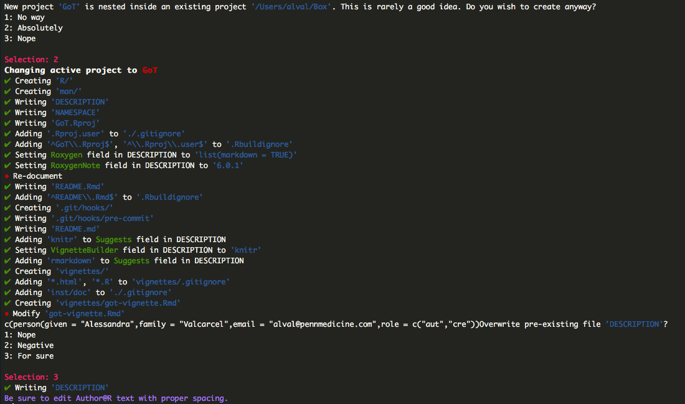

```{r setup, include = FALSE}
knitr::opts_chunk$set(
  collapse = TRUE,
  comment = "#>"
)
```

## Overview

In this vignette, we will walk through how to implement `aliviateR` functions to create a package. The package does not make creating a package fully automated and you will still need to tweak some of the package information before going live. We will go through how to use the `aliviateR` functions to help you create a package as well as what is leftover that you will need to change.

You will need GitHub installed and set up with R. Check out some more information in the readme or at these links:

[RStudio Support](https://support.rstudio.com/hc/en-us/articles/200532077-Version-Control-with-Git-and-SVN)

[R packages by Hadley Wickham](http://r-pkgs.had.co.nz/git.html)

[Blog](http://happygitwithr.com/rstudio-git-github.html)

## Installation

`aliviateR` is currently only available as a development version from [GitHub](https://github.com/). You can download this version with:

```{r, eval = FALSE}
# install.packages("devtools")
devtools::install_github("avalcarcel9/aliviateR")
```

```{r}
library(aliviateR)
```


For any issues, please feel free to email me or submit and issue.

## Tutorial Information

In this tutorial I am going to create an R package that scrapes Game of Thrones data from the internet. After this tutorial, I will actually host the package on my [GitHub](https://github.com/avalcarcel9). You can follow along whether you have functions or not but know that this will be generating folders on your machine.

## Create Package Structure

Before anything we will generate the package structure required to host a package using the function `aliviateR::alval_flow`. This function will:

1. Create a folder with the package name you specify in the path specied
2. Create a vignette `vignette_name` is not NULL
3. Create testing folder structure if `testing = TRUE`
4. Manipulate the DESCRIPTION file Title, Description, Maintiainer, and Author@R fields based on the inputs.

By default these are set to my own personal preferences and information but you can easily change any for your own flow or package.

For this example, I am going to create an R package called "GoT". I changed the default `test = TRUE` to `testing = FALSE` as I don't want to set up testing for this package. I also specify a  `title` and `description` specific to this package. 

```{r, eval = FALSE}
alval_flow(path = '/Users/alval/Box/Research', 
           pkg_name = 'GoT', 
           vignette_name = 'GoT Vignette',
           testing = FALSE, 
           title = "Scrape Game of Thrones (GoT) Data",
           description = "Scrapes Game of Thrones (GoT) data from multiple sources. The package can scrape scripts from episodes available on from www.genius.com. Additionally, the package can scrape character lists from http://awoiaf.westeros.org/index.php/List_of_characters and https://www.hbo.com/game-of-thrones/cast-and-crew. Lastly, the package can scrape death timeline data from https://deathtimeline.com/.",
           firstname = "Alessandra", 
           lastname = "Valcarcel",
           email = "alval@pennmedicine.com", 
           role = c("aut", "cre"))
```

If you specified to allow for a vignette then the vignette will open in your R session. Unfortunately, I can't run this and show output without changing my local directories I'll show a screen shot of the output from successfully running this function.

<center><\center>

This functions wraps functions from `usethis`. Many will need user input to run so you will notice that you will need to respond with numbers to the prompts. For example, you can see I had to choose to modify the description and select "3: For sure". Be sure to read this carefully and answer with what you would like to do for your package.

If you go to the path you specified you will now see a folder with the package name you specified and some contents. Here is a screenshot of my folder.

<center><\center>

Notice that the man and R folders are empty. We will fill the R folder with content in a bit and will let `roxygen2` fill our man and namespace.

Before we move on though, you'll definitely need to go into the description and fix the Author@R field with your information.

## Initalize with GitHub


